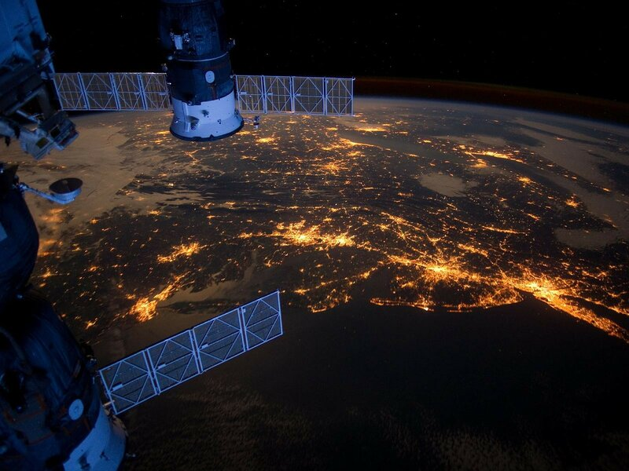

<div align="center">

# 🦚 Mayil Vision

[](LICENSE)
[](https://www.python.org/)
[](https://streamlit.io/)
[](https://planetarycomputer.microsoft.com/)

**[🎯 Quick Start](#-quick-start)** • 
**[✨ Features](#-features)** •
**[🚀 Installation](#-Installation)**

<p align="center">
  
</p>


</div>

## 🎯 What is Mayil Vision?

**Mayil Vision** is a professional-grade multi-sensor satellite intelligence framework designed for the automated monitoring of critical energy infrastructure. Derived from the Tamil word for "Peacock" (மயில்), the platform acts as an all-seeing guardian, utilizing the full electromagnetic spectrum to ensure grid resilience.

The framework orchestrates a fleet of specialized analysis engines that fuse optical, thermal, and radar data to identify risks - from encroaching vegetation to invisible methane leaks - before they escalate into costly failures.

> 💡 **Philosophy**: Just as the peacock's tail is adorned with a thousand eyes, Mayil Vision provides a thousand perspectives on infrastructure health through high-revisit satellite constellations.

---

## ✨ Features

<table>
<tr>
<td width="50%">

### 🌿 **VegWatch (Sentinel-2)**
- NDVI-based biomass encroachment detection
- Automated risk classification for power lines
- Dynamic cloud-masking for optical precision

### 🌡️ **ThermalAlert (Landsat 8/9)**
- Land Surface Temperature (LST) anomaly detection
- Monitoring of substation and transformer health
- Historical heat-trend visualization

</td>
<td width="50%">

### ☁️ **GasWatch (Sentinel-5P)**
- Atmospheric $CH_4$ concentration mapping
- Daily global coverage for pipeline monitoring
- Quantitative emission plume detection

### 🛰️ **GroundGuard (Sentinel-1)**
- SAR-based ground deformation monitoring
- Foundation stability assessment via radar
- All-weather, day-and-night surveillance

</td>
</tr>
</table>


## 🚀 Installation

### Quick Start

```bash
# Clone the repository
git clone https://github.com/your-username/Mayil-Vision.git
cd Mayil-Vision

# Create virtual environment
python -m venv venv
source venv/bin/activate  # Windows: venv\Scripts\activate

# Install dependencies
pip install -r requirements.txt
```

## 🤝 Contributing

We welcome contributions! Here's how you can help:

<table>
<tr>
<td align="center" width="25%">

### 🐛 Bug Reports
Found a bug?
[Open an issue](https://github.com/sakimsan/LeopardX/issues)

</td>
<td align="center" width="25%">

### 💡 Feature Requests
Have an idea?
[Start a discussion](https://github.com/sakimsan/LeopardX/discussions)

</td>
<td align="center" width="25%">

### 📝 Documentation
Improve docs
[Edit on GitHub](https://github.com/sakimsan/LeopardX)

</td>
<td align="center" width="25%">

### 🔧 Code
Submit a PR
[Contributing Guide](CONTRIBUTING.md)

</td>
</tr>
</table>

---

## 📄 License

This project is licensed under the **Apache License 2.0** - see the [LICENSE](LICENSE) file for details.

```
Copyright 2026 Mayil Vision Contributors

Licensed under the Apache License, Version 2.0 (the "License");
you may not use this file except in compliance with the License.
```
---

<div align="center">

### Built with ❤️ in Germany

[⬆ Back to Top](#-mayil-vision)

</div>
